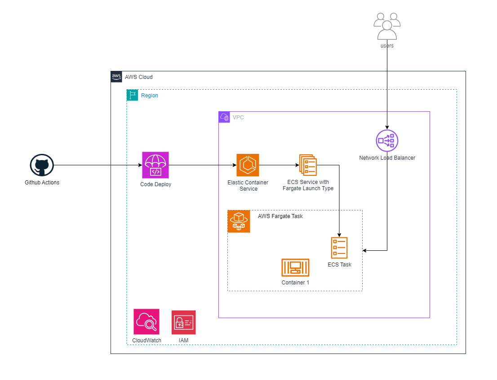

# Pagarme Projeto aws-challenges
<details>
  <summary>Descrição do Desafio Pagarme</summary>

## Introducao
[Keep it simple](https://pt.wikipedia.org/wiki/Princ%C3%ADpio_KISS), entendemos que você possui suas prioridades e nossa proposta com esse desafio é ter uma idéia de como você faz seus códigos, toma suas decisões arquiteturais e o seu conhecimento geral sobre os assuntos abordados.

Seu desafio precisa estar versionado no Github, em um repositório público ou privado (vamos te passar usuários do Github para compartilhar a solução se for a sua preferência).

A documentação é primordial e vamos nos guiar por ela, então documente os passos no README do projeto ;-)

A aplicação deve ser fácil de ser executada localmente
Não tem problema se você não conseguir finalizar tudo! Não deixe de enviar seu desafio por isso!

Temos alguns entregáveis que vão nos ajudar a entender em que ponto você está tecnicamente. Será muito legal se você nos mandar ao menos o entregável 1 completo, mas se isso não for possível, não deixe de mandar o case até onde conseguiu, queremos ver o seu código e a sua linha de raciocínio, avaliamos tudo ;-)
Temos um entregável que chamamos de **plus**, e será muito legal se você chegar até lá \o/

## Entregável 1

- Desenvolver uma API na linguagem de sua preferência sem se preocupar com camada de persistência.
- Um Dockerfile para essa API para conseguirmos subí-la localmente.
- Uma pipeline de CI para essa API utilizando Github Actions ou algum outro de sua preferência.
- Subir a aplicação na AWS (provavelmente você terá que assinar uma conta free tier ou se aproveitar de limites gratuitos oferecidos pelo cloud provider).
- Criar o terraform para sua aplicação
- Criar a pipeline de CD para essa API utilizando tecnologia de sua preferência
- Criar um relatório da entrega sobre o motivo da escolha de determinada tecnologia

> **Warning**
>: Apesar de sua simplicidade, trate a aplicação como algo que fosse ser usado no mundo real. Não deve haver duplicidade de dados, por exemplo. A API deve retornar os dados de forma correta e consistente. Mesmo as coisas simples precisam de atenção e qualidade 💚


## Entregável 2
 - Configurar o monitoramento da aplicação utilizando a tecnologia que preferir, definindo alertas importantes
 - Torne sua aplicação clusterizada
 - Disponha do monitoramento do cluster


## Plus ##

Configure o deploy utilizando uma tecnologia provida pela AWS


## Tecnologias que usamos e voce pode se inspirar
Aqui dentro do time temos algumas tecnologias que usamos no dia-a-dia e gostaríamos de validar seu conhecimento nas mesmas, sendo elas:
 - [ ] Terraform
 - [ ] Git
 - [ ] Github Actions
 - [ ] AWS ECS
 - [ ] AWS EKS
 - [ ] Golang
 - [ ] CodeDeploy
 - [ ] Cloudwatch

Estas são as tecnologias que usamos, mas sinta-se a vontade para trazer quaisquer nova tecnologia que julgar pertinente para o case apresentado, estamos de braços abertos a novos conhecimentos 💚

</details>

## Aplicação Web em Flask (Python) - Loja de Esculturas

Este repositório contém o código fonte para uma aplicação web desenvolvida em Python utilizando o micro-framework Flask. O site foi projetado para funcionar como uma loja virtual na venda de esculturas. Ele oferece uma interface amigável onde os usuários podem visualizar uma lista de esculturas disponíveis para compra.

## Relatório de Entrega
As escolhas das tecnologias foram baseadas na melhor interação e descrição do desafio. Anteriormente, eu não utilizava tecnologias como o GitHub Actions; no entanto, ao iniciar os testes da pipeline, percebi que ela era bastante semelhante ao que já tinha experiência anterior (GitLab e Azure Pipeline). As pipelines são compostas por testes unitários, atualização da imagem no Docker Hub e, posteriormente, o deploy do serviço ECS. A escolha da pipeline de deploy foi o próprio GitHub Actions, integrado ao CodeDeploy. Esta tecnologia de deploy foi selecionada pela praticidade e boa documentação do Actions, além de sua integração com o CodeDeploy. O framework escolhido foi o Flask, devido à minha familiaridade com Python e pela simplicidade de desenvolvimento que ele oferece, sendo ideal para este projeto.

A estrutura de diretórios do Terraform foi planejada para facilitar a compreensão dos recursos, organizando-os em pastas específicas para cada módulo. Importante ressaltar que nenhum recurso é criado no arquivo main.tf principal, permitindo assim que o código seja facilmente reutilizável.

A tecnologia de monitoramento escolhida foi o CloudWatch da AWS, o módulo do CloudWatch conta com três alertas: dois deles são gerados pelo próprio CloudWatch, monitorando a utilização de CPU e memória, e o terceiro é gerado pelo EventBridge, que verifica o estado da task. Se a task estiver parada, ele gera uma notificação. Todos esses alertas são enviados por SNS via email, o que é crucial para a monitoração e a resposta rápida a potenciais problemas.

## Desenvolvimento local

Passos para executar localmente:

1. (Opcional) [Crie um ambiente virtual Python](https://docs.python.org/3/tutorial/venv.html#creating-virtual-environments) e ative-o.

1. Instale os requisitos:

    ```shell
    python3 -m pip install -r requirements.txt
    ```

1. Execute o servidor local:

    ```shell
    python3 -m flask --debug run --port 8080
    ```

1. Clique em 'http://localhost:8080' no terminal, o que deve abrir o site em uma nova aba.

## Desenvolvimento local no Docker

1. Construa a imagem Docker manualmente clonando o repositório Git.

  ```shell
  git clone https://github.com/GGXARAUJO/pagarmeproj.git
  ```

2. Construa a imagem pré-criada

```shell
docker build -t ggxaraujo/flask-web-escultura .
```

Você também pode baixar a imagem existente do [DockerHub](https://hub.docker.com/r/ggxaraujo/flask-web-escultura).

3. Baixe a imagem do Dockerhub

  ```shell
  docker pull ggxaraujo/flask-web-escultura:prod
  ```

4. Execute um contêiner a partir da imagem.

  ```shell
  docker run --name my-container -d -p 8080:8080 ggxaraujo/flask-web-escultura:prod
  ```

Agora visite http://localhost:8080

### Pré-requisitos

> Este modelo criará infraestrutura e implantará código na AWS.

Os seguintes pré-requisitos são necessários para usar esta aplicação. Por favor, certifique-se de que todos estão instalados localmente.

- [CLI do Desenvolvedor AWS](https://docs.aws.amazon.com/pt_br/cli/latest/userguide/getting-started-install.html)
- [Python (3.8+)](https://www.python.org/downloads/)
- [CLI do Terraform](https://developer.hashicorp.com/terraform/tutorials/aws-get-started/install-cli#install-terraform)


### Diagrama da Infraestrutura:



### Infraestrutura com o Terraform na AWS
A infraestrutura é composta pelos seguintes módulos:

- Virtual Private Cloud (VPC)
- Security Group
- ECS Task
- ECS Service
- CodeDeploy
- NLB (Network Load Balancer)
- ECS Cluster
- IAM-ECS
- CloudWatch

### GitHub Actions - CI/CD

Na pasta [.github/workflows](https://github.com/GGXARAUJO/pagarmeproj/blob/main/.github/workflows) encontram os pipelines atualmente implementados

- [.github/workflows/prod.yaml](https://github.com/GGXARAUJO/pagarmeproj/blob/main/.github/workflows/prod.yml): Este workflow do GitHub Actions é acionado em pull requests para a branch 'main', realizando build, linting e testes do código, seguidos pelo deploy em produção usando Code Deploy.
    
- [.github/workflows/dev.yaml](https://github.com/GGXARAUJO/pagarmeproj/blob/main/.github/workflows/dev.yml): Este workflow do GitHub Actions é acionado ao fazer push para todas as branches exceto 'main', compilando e analisando o código, e em seguida executando testes.
